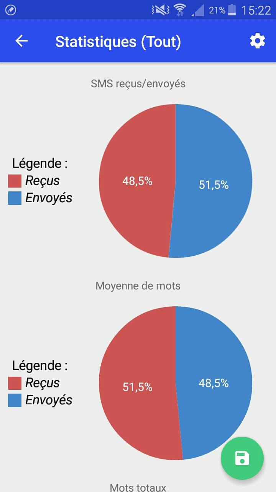
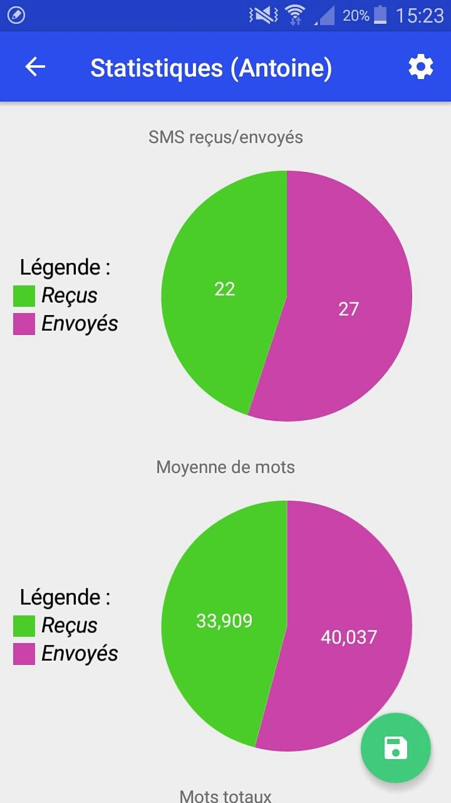
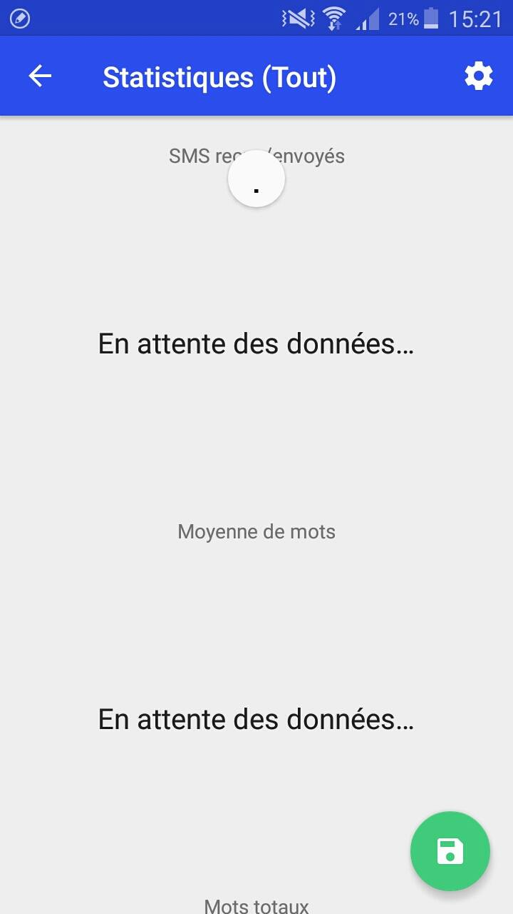
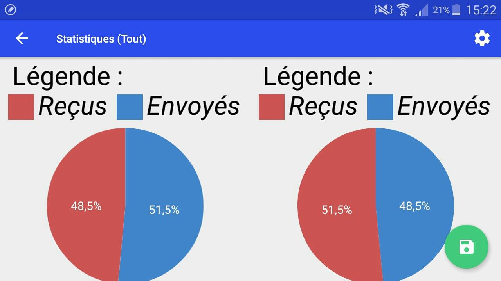

# SMS-Analyser
Show some statistics from sms received and sent to the connected device.

Features
========
- Generate statistics from a contact or all contacts and show it
- Show the data in percent or real values by pressing on the graph or change that in the settings
- Change the color of the graphs in the settings
- Change the type of graph in the settings. Currently, there is a BarGraph and a PieGraph.
- Change the orientation of the screen adapt the activity
- Save into a file those statistics
- Load from a file statistics

Screenshots
===========

